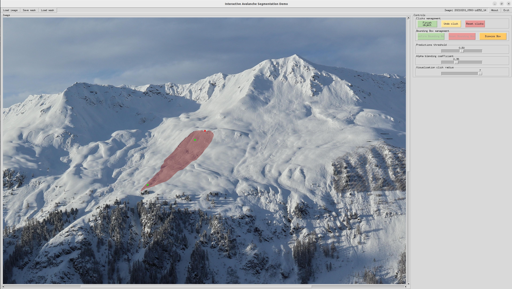

## Interactive segmentation for avalanches
This repository provides the source code for the click-based interactive segmentation model for the following paper

> **Interactive Snow Avalanche Segmentation from Webcam Imagery: results, potential and limitations**<br>
> Hafner, E. D., Kontogianni, T., Caye Daudt, R., Oberson, L., Wegner, J. D., Schindler, K., and Bühler, Y., EGUsphere [preprint],<br>
> https://doi.org/10.5194/egusphere-2024-498, 2024.
>
the code that served as a basis was initially developed and published in the following paper and repository 
> **Konstantin Sofiiuk, Ilia Petrov, Anton Konushin**<br>
> Reviving Iterative Training with Mask Guidance for Interactive Segmentation,<br>
> Computer Vision and Pattern Recognition, https://arxiv.org/abs/2102.06583, 2021.<br><br>
> https://github.com/SamsungLabs/ritm_interactive_segmentation


## Setting up the environment

This framework is built using Python 3.6 and relies on the PyTorch 1.4.0+. The following command installs all 
necessary packages:

```.bash
pip3 install -r requirements.txt
```

If you want to run training or testing, you must configure the paths to the datasets in [config.yml](config.yml).

## Interactive Avalanche Segmentation Demo

<p align="center">
  
</p>

The GUI is based on TkInter library and its Python bindings. You can try to interactivly segment avalanches with the demo with one of the 
[provided models](#pretrained-models). The scripts automatically detect the architecture of the loaded model, you only need to 
specify the path to the corresponding checkpoint.

Examples of the script usage:

```.bash
# This command runs interactive demo with the model trained on the SLF dataset from /data/ritm_interactive_segmentation/datasets/checkpoints/
# If you also do not have a lot of GPU memory, you can reduce --limit-longest-size (default=800; 3600 was the longest we could handle with a NVIDIA GeForce RTX 2080 Ti)
python3 demo.py --checkpoint=/data/ritm_interactive_segmentation/datasets/checkpoints/082_epo090.pth --gpu=0 --limit-longest-size=3600

# You can try the demo in CPU only mode
python3 demo.py --checkpoint=/data/ritm_interactive_segmentation/datasets/checkpoints/082_epo090.pth --cpu
```

**Controls**:

| Key                                                           | Description                        |
| ------------------------------------------------------------- | ---------------------------------- |
| <kbd>Left Mouse Button</kbd>                                  | Place a positive click             |
| <kbd>Right Mouse Button</kbd>                                 | Place a negative click             |
| <kbd>Roll scroll Wheel</kbd>                                  | Zoom an image in and out           |
| <kbd> Push scroll Wheel</kbd>                                 | Pan the image                      |
| <kbd>Left Mouse Button</kbd> + <br> <kbd>Move Mouse</kbd>     | Create a bounding Box              |
| <kbd>Space</kbd>                                              | Finish the current object mask     |


**Correct existing external segmentation mask**:

A user can initialize the model with an external mask before placing any clicks and correcting the mask using the same interface. 
To do so the demo can be run with any model train configuration and an external mask can be added via the "Load mask" button in the menu bar and consequently adapted.


**GUI visualization parameters**:
        <li><i>Prediction threshold</i> slider adjusts the threshold for binarization of probability map for the current object.</li> 
        <li><i>Alpha blending coefficient</i> slider adjusts the intensity of all predicted masks.</li>
        <li><i>Visualisation click radius</i> slider adjusts the size of red and green dots depicting clicks.</li>


## Datasets

As baseline we use the model by Sofiiuk et al trained on COCO+LVIS, then we finetune on our own avalanche dataset (SLF), on avalanche images from the University of Innsbruck (UIBK) and a combination of those two. 

| Dataset    |   Data size          |      Download Link       |
|------------|----------------------|:------------------------:|
|SLF dataset |  300+ avalanches     |  [data][SLF]             |
|UIBK dataset|  3000+ avalanches    |  [data][UIBK]            |

[SLF]: http://envidat.ch
[UIBK]: https://researchdata.uibk.ac.at//records/h07f4-qzd17


Don't forget to change the paths to the datasets in [config.yml](config.yml) afterwards.

## Testing

### Pretrained models
We provide pretrained models with different backbones for interactive segmentation.

You can find model weights and evaluation results in the tables below:

| Dataset    |       PTH model file         |
|------------|:----------------------------:|
|SLF         |  [082_epo095.pth][SLF1]      |
|UIBK        |  [116_epo090.pth][UIBK1]     |
|SLF + UIBK  |  [115_epo095.pth][SLF_UIBK]  |

[SLF1]: addlinkgit.pth
[UIBK1]: addlinkgit.pth
[SLF_UIBK]: addlinkgit.pth


### Evaluation

To test any of our avalanche models, specify the path to the corresponding checkpoint and use the evaluate_model.py script. 
The script automatically detects the architecture of the loaded model. The resize command only affects images larger than the given size. 

Example for evaluation:
```.bash
# This command evaluates the model trained on UIBK data in NoBRS mode on the UIBK test dataset
python3 scripts/evaluate_model.py NoBRS --checkpoint=datasets/checkpoints/082_epo090.pth --datasets=Avalanche_uibk --resize 3600 2400
```
## Training

Below you find the scripts for training our model on an avalanche dataset. You can start training with the following command:
```.bash
python3 train.py models/iter_mask/hrnet18_avalanche_itermask_3p.py --gpus=0 --workers=4 --exp-name=train_test --weights=weights/coco_lvis_h18_itermask.pth --batch-size=4

```
The data to be used needs to be specified in the [model](models/iter_mask/hrnet18_avalanche_itermask_3p.py) and in the [config.yml](config.yml)(see `EXPS_PATH` 
variable). For each experiment, a separate folder is created in the `./experiments` with Tensorboard logs, text logs, 
visualization and checkpoints. You can specify another path in the [config.yml](config.yml). If you want to train interactive segmentation from an existing model, you need to download the weights and specify the paths to 
them in [config.yml](config.yml).

## License

The original code was released under the MIT License by Sofiiuk et al. You may consequently do whatever you want with the code as long as you include the original and our copyright and license notice in any copy of the software/source. 

## Citation

If you find this work is useful for your research, please cite our paper:
```
@Article{hafner_ias2024,
AUTHOR = {Hafner, E. D. and Kontogianni, T. and Caye Daudt, R. and Oberson, L. and Wegner, J. D. and Schindler, K. and B\"uhler, Y.},
TITLE = {Interactive Snow Avalanche Segmentation from Webcam Imagery: results, potential and limitations},
JOURNAL = {EGUsphere},
VOLUME = {2024},
YEAR = {2024},
PAGES = {1--23},
URL = {https://egusphere.copernicus.org/preprints/2024/egusphere-2024-498/},
DOI = {10.5194/egusphere-2024-498}
}
```
as well as the work we were able to built upon:
```
@article{sofiiuk_ios2021,
  title={Reviving Iterative Training with Mask Guidance for Interactive Segmentation},
  author={Sofiiuk, Konstantin and Petrov, Ilia and Konushin, Anton},
  journal={arXiv preprint arXiv:2102.06583},
  year={2021}
}
```
